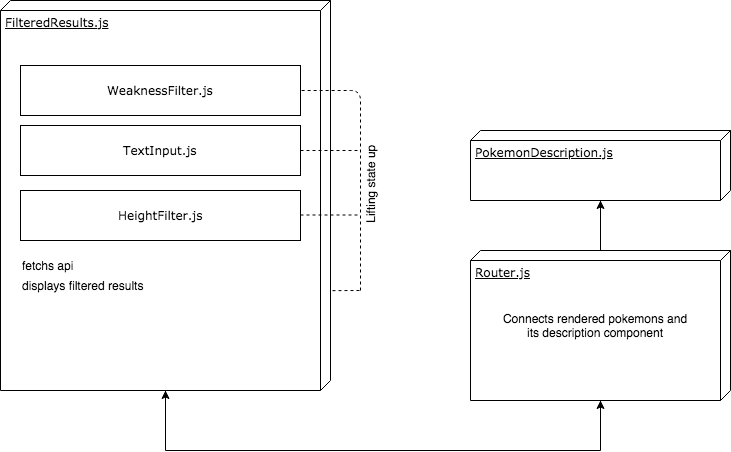
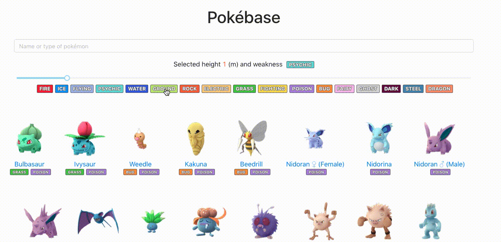

### Pokémon database

#### Important dependencies

* Ant Design: I've used this UI library with a set of pre-built React components such as `Slider` and `Input`. Also, this app uses its default font.
* Bootstrap: grid used, nothing else.
* Jest: for testing.
* React router: created navigation for new pages containing pokémon description.

#### Architecture

I think that usage of Redux is an overkill solution for small applications like this one. That's why I decided to use "lift shared state up" solution instead. Here's the diagram showing components interactions. I haven't listed `Header.js` because it renders directly in `App.js`.

#### Improvements

The current version of this app is far away from what I expected to create. I listed some improvements what I have in mind now.

*Maintainability*

* Remove duplicates from code and make conditional rendering smarter

*Performance*

* Improve filter performance by changing conditions

*Design*

* Make it more interactive by addind CSS animations (add shining shadow on hover for pokemons, smoothly display pokemons on scroll)
* Change `PokemonDescription.js`component design because it look poor now

*Other*

* Share filter parameters as link
**It could be done using redux (or packages like [redux-query-sync](https://www.npmjs.com/package/redux-query-sync)) or simply using React Router**

